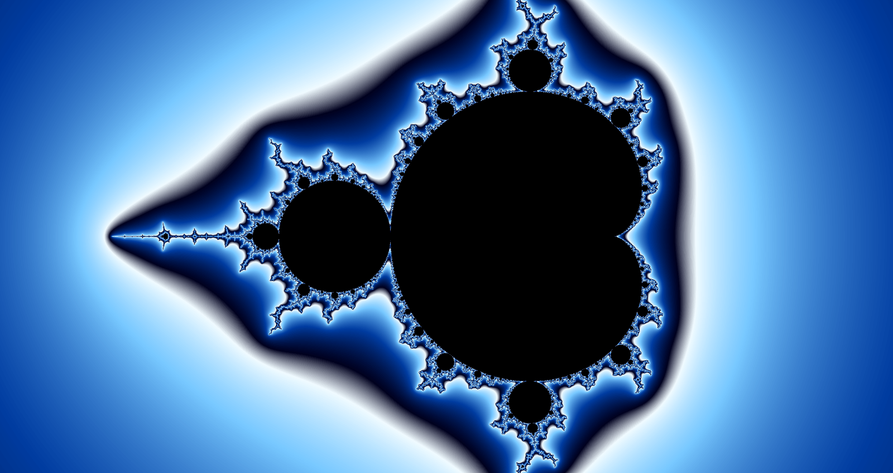

# helge

A personal Mandelbrot fractal generator and viewer for Chrome, with zoom to extreme depth via
perturbation and bilinear approximation. Named for Niels Fabian Helge von Koch, whose snowflake
encloses a finite area behind an infinite edge.



```bash
npm install
npx playwright install chromium   # once, for the browser test
npm run dev                       # http://localhost:5173/
```

Scroll to zoom about the cursor, drag to pan, double-click to zoom in, `R` to reset, `S` to save a
PNG, `?` for the full key list. Every view is in the URL, so bookmarks and the back button work.

To remove it, deleting the clone takes `node_modules` with it, but the Chromium download lives in a
shared cache outside the repository. `npx playwright uninstall` clears the browsers this checkout
installed; `--all` clears every Playwright browser on the machine, including those other projects
rely on.

Design: [`docs/changes/2026-09-17-mandelbrot-fractal-generator-and-viewer/spec.md`][design].

[design]: docs/changes/2026-09-17-mandelbrot-fractal-generator-and-viewer/spec.md
